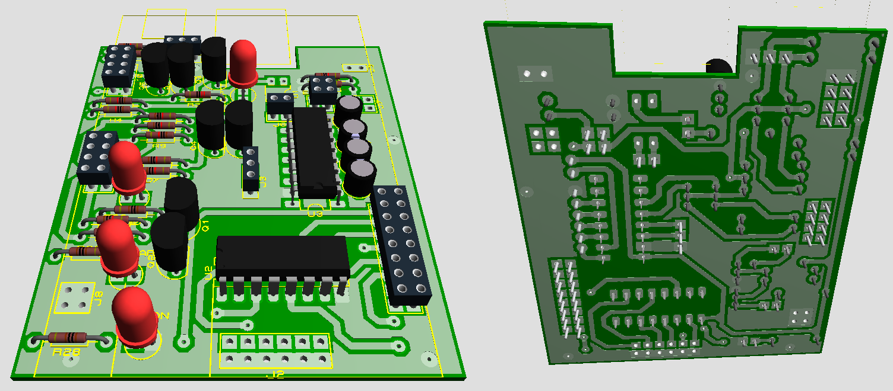
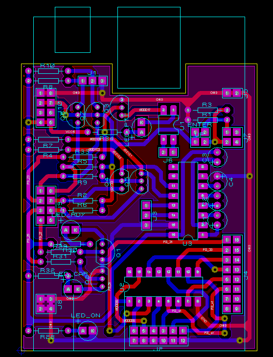
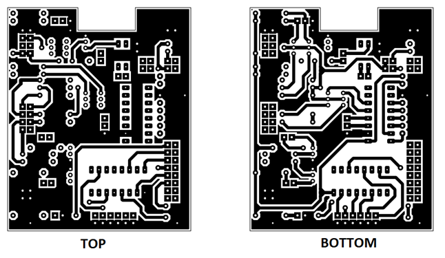
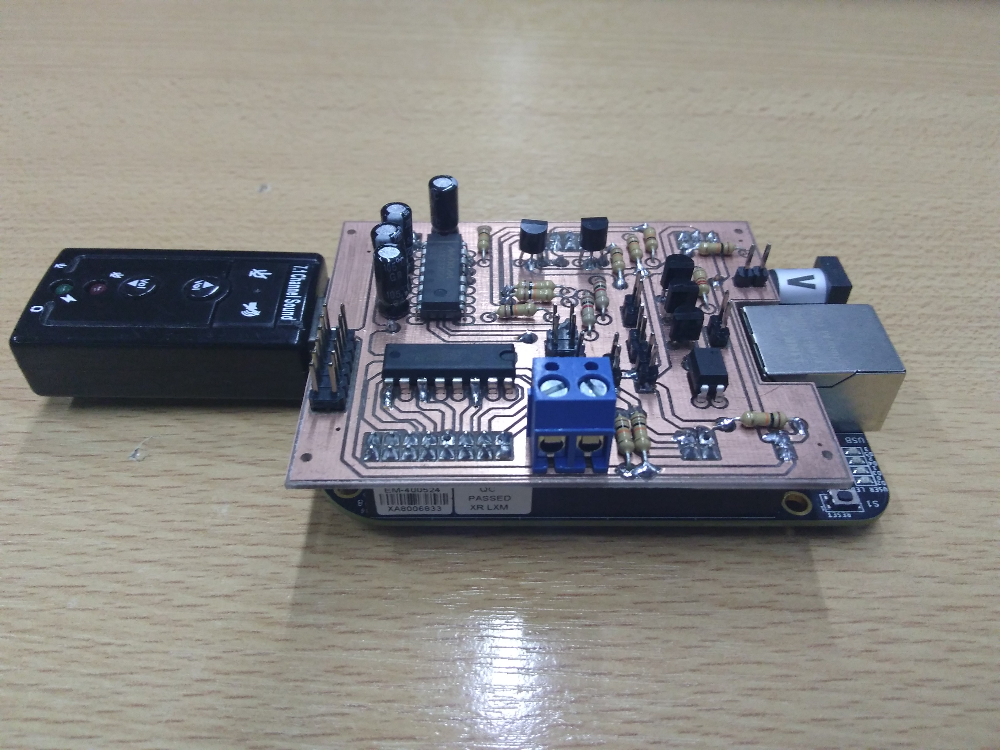
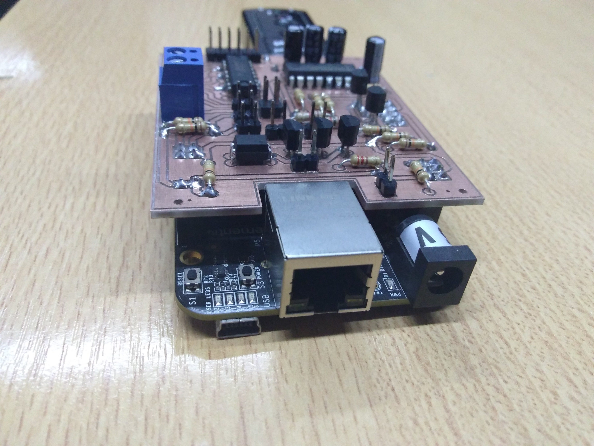
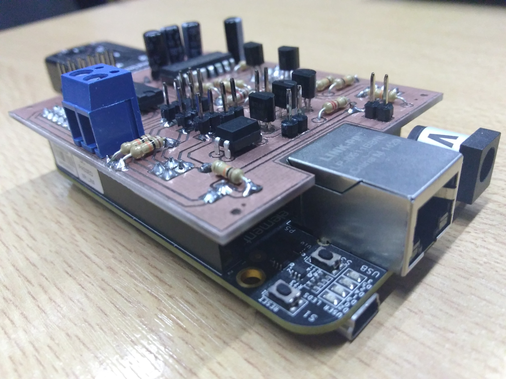

# RF_Shield_Beaglebone_Black

PCB de doble capa diseñado para usarse como shield de la Beaglebone Black, como interfaz de un sistema de comunicaciones RF. Se utilizó Proteus 7 (ISIS/ARES) para el diseño del esquemático y PCB. El prototipo se fabricó con una fresa CNC a partir de los archivos Gerber. 

Se puede ver el proyecto completo en esta publicación que realicé en el Congreso Argentino de Sistemas Embebidos: [CASE 2018](Paper_CASE2018.pdf)

 

